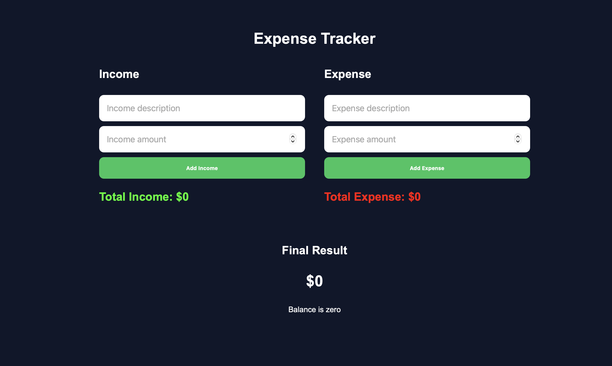
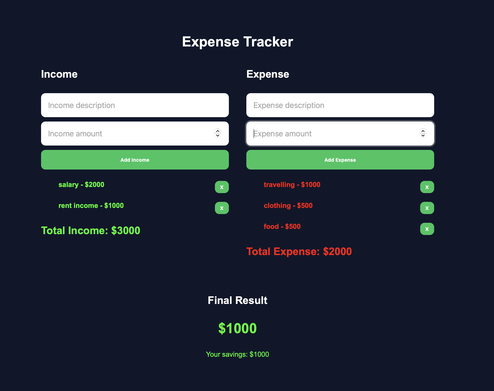
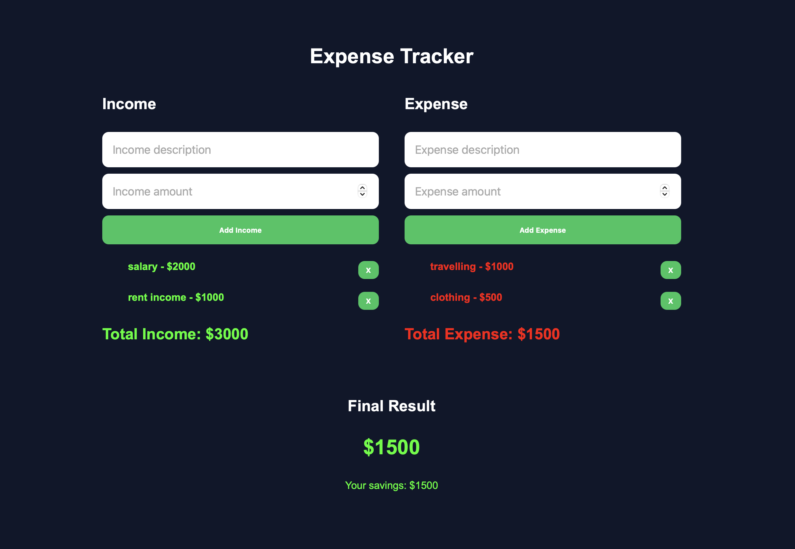

# Expense Tracker
A simple expense Tracker built with HTML,CSS and JavaScript.

## Features

-Add income
-Add expenses
-Delete transactions
-Calculate total income
-Calculate total expenses
-Show final balance
-Local Storage support
-Enter key support

## Technologies
-HTML5
-CSS3
-JavaScript

##Live Demo
Click here to try:
https://calmstudiodev.github.io/expense-tracker

## Screenshots

### Home Screen

### Example 1

### Example 2

